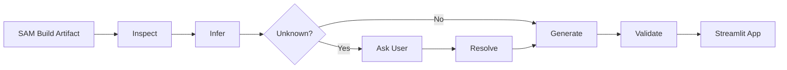

### 現時点での Skill の責務

最初の設計骨格は、次のように置くのがよいと考えます。

```text
.aws-sam/build/template.yaml
           │
           ▼
      SAM Event Parser
           │
           ▼
┌─────────────────────────────┐
│       Streamlit UI          │
│                             │
│ Event                       │
│   ↓                         │
│ Routing                     │
│   ↓                         │
│ Processing                  │
│   ↓                         │
│ State                       │
└─────────────────────────────┘
           │
           ▼
 sam local start-lambda
           │
           ▼
      Local Lambda
```

ここで重要なのは、**単なる Lambda テストツールではなく、「Event → Routing → Processing → State」というサーバーレスの思考モデルを体験する教材兼デバッグツールを生成する Skill** と定義することです。

## 第1回 Q&A：Skill の境界を決めたい

まず次の4点を決めたいです。私の推奨案には **★** を付けています。

**Q1. 対応する SAM Event の範囲はどこまでにしますか？**

* A. `Api` / `HttpApi` のみ
* **B. ★ `Api / HttpApi / SQS / SNS / EventBridgeRule / S3`**
* C. DynamoDB / Kinesis / Schedule なども含め主要イベント全般
* D. SAM がサポートする EventSource を可能な限り全部

B を推します。同期・非同期・Pub/Sub・Event Bus・Object Event が揃うため、サーバーレスのイベント駆動モデルを十分体験できます。一方、最初から全 EventSource を対象にすると生成コードがかなり複雑になります。SAM の `Events` がサポートする種類自体はさらに広範です。([AWS ドキュメント][1])

---

**Q2. Routing はどのレベルまで再現しますか？**

* A. Event Type → Lambda の対応を表示するだけ
* **B. ★ 実際のルーティング条件も評価する**
* C. LocalStack 等を起動して AWS サービスそのものをエミュレートする

B の場合、例えば次のようになります。

```text
API
POST /orders
    ↓ path + method match
CreateOrderFunction

EventBridge
source = "demo.order"
detail-type = "OrderCreated"
    ↓ EventPattern match
ProcessOrderFunction

S3
ObjectCreated
suffix = ".csv"
    ↓ filter match
ImportCsvFunction
```

これなら AWS サービス自体を起動しなくても、

> 「イベントが発生したから Lambda が動く」のではなく
> 「Routing 条件に一致したイベントだけが Processing に到達する」

ことをUI上で体験できます。

---

**Q3. 最後の `State` は何を意味させますか？**

ここは Skill の性格を大きく左右します。

* A. Lambda のレスポンスを State として表示
* B. Streamlit 内の SQLite / JSON に状態を保存
* C. DynamoDB Local / LocalStack 等の外部状態を表示
* **D. ★ State Adapter方式にして、構成によって切り替える**

D なら、

```text
Processing
    │
    ├─ Lambda response
    │
    ├─ DynamoDB before / after
    │
    ├─ S3 object
    │
    └─ Demo State Store
            ↓
          State
```

という設計にできます。

個人的には、**「Lambda はステートレス、State は外部に存在する」ことを体感させる**ため、レスポンスだけを State と呼ぶのは避けたいです。

---

**Q4. Skill がどこまで自動化しますか？**

候補は次の3段階です。

* A. Streamlit ソースコードを生成するだけ
* B. ソースコード＋requirements＋起動スクリプトまで生成
* **C. ★ SAM プロジェクトを解析して、アプリ一式＋起動コマンド＋テストイベントまで生成**

C のイメージです。

```text
既存 SAM Project
│
├── template.yaml
├── src/
└── .aws-sam/
    └── build/
        └── template.yaml
          │
          ▼
       Skill実行
          │
          ▼
serverless-event-lab/
├── app.py
├── requirements.txt
├── core/
│   ├── sam_parser.py
│   ├── event_factory.py
│   ├── router.py
│   ├── lambda_client.py
│   └── state_adapter.py
├── ui/
│   ├── event_view.py
│   ├── routing_view.py
│   ├── processing_view.py
│   └── state_view.py
├── events/
│   └── generated/
└── run_demo.sh
```

Lambda 起動部分は、

```bash
sam build
sam local start-lambda \
  --template .aws-sam/build/template.yaml
```

としておき、Streamlit はローカル Lambda エンドポイントへ SDK 経由で invoke する設計です。AWS も `sam local start-lambda` を、SDK/CLI からローカル Lambda を呼び出すためのエンドポイントとして提供しています。([AWS ドキュメント][2])

---

### 私の推奨初期値

```yaml
event_scope:
  - Api
  - HttpApi
  - SQS
  - SNS
  - EventBridgeRule
  - S3

routing:
  mode: evaluate_rules

processing:
  runtime: sam-local-start-lambda
  invocation: boto3

state:
  mode: adapter

skill_output:
  generate_streamlit_project: true
  generate_test_events: true
  generate_run_script: true
```

まず **Q1〜Q4について `B / B / D / C` のように回答してください。**

その回答を受けて、次は **Streamlit の画面構成と「Event → Routing → Processing → State」の可視化方法**をQ&Aで決め、その時点から実際の `SKILL.md` 本文を組み立てていきます。

[1]: https://docs.aws.amazon.com/serverless-application-model/latest/developerguide/sam-property-function-eventsource.html?utm_source=chatgpt.com "EventSource - AWS Serverless Application Model"
[2]: https://docs.aws.amazon.com/serverless-application-model/latest/developerguide/sam-cli-command-reference-sam-local-start-lambda.html?utm_source=chatgpt.com "sam local start-lambda - AWS Serverless Application Model"

---

了解です。これで Skill の基本アーキテクチャは次で固定します。

```text
対象 Event:
Api / HttpApi / SQS / SNS / EventBridgeRule / S3

Routing:
SAM Events 定義からルーティング条件を抽出し、
Streamlit 側で実際に match / no-match を評価

Processing:
sam local start-lambda
        ↓
boto3 Lambda Client
        ↓
Local Lambda

State:
Adapter方式

生成物:
Streamlitアプリ一式
+ テストイベント
+ requirements
+ 起動スクリプト
```

つまり Skill の中心概念は、

```text
Event
  ↓
Routing
  ↓
Processing
  ↓
State
```

を**見るだけではなく、イベントを変化させながら各段階の挙動を体験すること**に置きます。

## 第2回 Q&A：Streamlit の体験設計

ここでは「どんな操作をするとサーバーレスを理解できるか」を決めます。

### Q5. メイン画面をどの形式にするか

**A. 4タブ**

```text
[ Event ] [ Routing ] [ Processing ] [ State ]
```

各フェーズを詳しく観察できます。

**B. 縦方向 Pipeline**

```text
┌─────────────────────┐
│ Event               │
│ SQS / API / SNS ... │
└──────────┬──────────┘
           ▼
┌─────────────────────┐
│ Routing             │
│ MATCH ✓             │
└──────────┬──────────┘
           ▼
┌─────────────────────┐
│ Processing          │
│ CreateOrderFunction │
└──────────┬──────────┘
           ▼
┌─────────────────────┐
│ State               │
│ orders: 10 → 11     │
└─────────────────────┘
```

**C. ★ Pipeline + 詳細タブ**

上部に Pipeline、下部に

```text
[ Event Detail ]
[ Routing Detail ]
[ Processing Detail ]
[ State Detail ]
```

を表示します。

**推奨：C**

デモ時には全体像が見え、技術者が詳細を調べたい場合には各フェーズを掘り下げられます。

---

### Q6. Event をどう作るか

**A. JSON を直接入力**

```json
{
  "source": "demo.order",
  "detail-type": "OrderCreated"
}
```

**B. UIフォームから生成**

例えば EventBridge なら、

```text
Source
[ demo.order       ]

Detail Type
[ OrderCreated     ]

Order ID
[ ORD-1001         ]

[ Send Event ]
```

**C. ★ 3方式**

```text
Sample
  ↓
Form
  ↓
Raw JSON
```

つまり、

```text
[ Sample ▼ ]

OrderCreated
OrderCancelled
PaymentCompleted
```

を選択するとフォームとJSONが生成され、

```text
Formを編集
     ↓
JSONも更新
     ↓
Send Event
```

とします。

**推奨：C**

サーバーレス初学者にも分かりやすく、上級者はRaw JSONを直接変更できます。

---

### Q7. Routing の見せ方

ここはこのアプリの重要部分です。

例えば SAM が、

```yaml
Events:
  OrderCreated:
    Type: EventBridgeRule
    Properties:
      Pattern:
        source:
          - demo.order
        detail-type:
          - OrderCreated
```

だった場合。

**A. 結果だけ**

```text
Routing result

✓ ProcessOrderFunction
```

**B. ★ 判定過程まで表示**

```text
Incoming Event
      │
      ▼
source
demo.order
      │
      ├── expected: demo.order
      │
      └── MATCH ✓
              │
              ▼
detail-type
OrderCreated
      │
      ├── expected: OrderCreated
      │
      └── MATCH ✓
              │
              ▼
Routing Result

ProcessOrderFunction
```

さらに意図的に、

```text
detail-type:
PaymentCompleted
```

へ変更すると、

```text
source       MATCH ✓
detail-type  NO MATCH ✗

Lambda invocation skipped
```

とします。

**推奨：B**

この機能によって、

> Event と Lambda の間には Routing という独立した責務が存在する

ことを視覚的に理解できます。

---

### Q8. State を何として見せるか

Adapter方式を採用することは決まっていますが、初期バージョンにどこまで入れるかです。

**A. Streamlit内部 State のみ**

```text
Before
orders = 3

After
orders = 4
```

実装は SQLite / JSON。

**B. DynamoDB Local中心**

```text
DynamoDB
OrdersTable

Before
────────────────
ORD001 PROCESSING

After
────────────────
ORD001 COMPLETED
```

**C. ★ Built-in State + 外部 Adapter**

標準では、

```text
DemoStateAdapter
```

を用意します。

さらにSAM解析結果によって、

```text
DynamoDB
S3
Lambda Response
```

などを Adapter として追加可能にします。

内部インターフェースは例えば、

```python
class StateAdapter:

    def snapshot_before(self):
        ...

    def snapshot_after(self):
        ...

    def diff(self):
        ...
```

とします。

Streamlitには、

```text
STATE CHANGE

Before                 After
────────────────────────────────
status: PENDING     →  COMPLETED
count:  10          →  11
```

と表示します。

**推奨：C**

これなら Skill が生成するアプリを、将来的に DynamoDB Local / LocalStack / Redis / SQLite などへ横展開できます。

---

## ここまで決まると生成 Skill の性格がかなり明確になります

最終的な利用イメージは、

```text
developer
   │
   │ sam build
   ▼
.aws-sam/build/template.yaml
   │
   ▼
Serverless Experience Skill
   │
   ├─ Events解析
   ├─ Lambda解析
   ├─ Routing解析
   ├─ Event Sample生成
   └─ State Adapter生成
            │
            ▼
     Streamlit Application
            │
    ┌───────┴────────┐
    │                │
 Event Editor    Architecture
    │
    ▼
 Routing Simulator
    │
    ▼
 Local Lambda
    │
    ▼
 State Difference
```

特にこの Skill を単なるコードジェネレータではなく、

> **SAM template を「実行可能なサーバーレス教材」に変換する Skill**

として定義すると、かなり特徴的なものになります。プロジェクトの目的である「サーバーレスアプリケーションの設計・開発・運用に関するインサイトを得る」という方向にも一致します。

**Q5〜Q8も推奨値なら `C / C / B / C` と回答してください。**

その次は **Q9〜Q12として「SAM解析」「生成コード構成」「エラー体験」「Skillとの対話方法」** を決めます。そこまで決まった段階で、実際の `SKILL.md` 初版を一度組み上げます。

---

確定しました。なおAWS公式仕様を確認すると、`sam build` は `.aws-sam/build/template.yaml` を生成し、その成果物をローカルテストにも利用します。また `sam local generate-event` でAWSサービスごとのサンプルイベントを生成できるため、**Event Sample生成は可能な限りSAM CLIを利用し、Skill独自実装を最小化する**方針がよさそうです。([AWS ドキュメント][1])

ここまでの確定事項を踏まえ、次の4点を決めます。

## Q9. SAM解析の入力元

### A. 元の `template.yaml`

開発者が編集するSAM Templateを直接解析します。

### B. `.aws-sam/build/template.yaml` のみ

```text
sam build
   ↓
.aws-sam/build/template.yaml
   ↓
Skill
```

### **C. ★ Build Templateを正本とし、存在しなければ停止**

```text
Skill起動
   ↓
.aws-sam/build/template.yaml exists?
   │
   ├─ YES → 解析
   │
   └─ NO
       ↓
   「sam build が必要」
       ↓
   必要なら sam build 実行を提案
```

元の `template.yaml` へ勝手にフォールバックしません。

これは重要で、Skillへの入力契約を、

> **「SAM Project」ではなく「SAM Build Artifact」**

と明確にできます。

また `.aws-sam/build` は `sam build` によって更新される成果物なので、ユーザーがアプリを変更した場合には再buildが必要です。([AWS ドキュメント][1])

**推奨：C**

---

# Q10. エラーも「体験」の対象にするか

成功だけなら、

```text
Event
  ↓
MATCH
  ↓
Lambda
  ↓
State Updated
```

ですが、サーバーレスを理解するには失敗系の方が教育効果があります。

### A. Happy Pathのみ

最初のバージョンでは正常系だけ扱います。

### B. Routing Errorまで

```text
Event
  ↓
Routing
  ↓
NO MATCH
  ↓
Processing skipped
```

### **C. ★ Failure Lab を持たせる**

次の5種類を体験可能にします。

```text
① Invalid Event
Event
 ↓
Validation Error


② Routing Miss
Event
 ↓
Routing
 ↓
NO MATCH


③ Lambda Exception
Event
 ↓
Routing
 ↓
Lambda
 ↓
Exception


④ Lambda Timeout
Event
 ↓
Routing
 ↓
Lambda
 ↓
Timeout


⑤ State Failure
Event
 ↓
Routing
 ↓
Processing
 ↓
State Adapter
 ↓
Write Error
```

Streamlitには例えば、

```text
┌ Event ────────┐
│ VALID       ✓ │
└──────┬────────┘
       ▼
┌ Routing ──────┐
│ MATCH       ✓ │
└──────┬────────┘
       ▼
┌ Processing ───┐
│ FAILED       ✗│
│ ValueError    │
└──────┬────────┘
       ▼
┌ State ────────┐
│ UNCHANGED     │
└───────────────┘
```

とします。

ただし **AWS Lambdaの非同期Retry、DLQ、EventBridge retryなどを実際に再現したとは表示しない**ことを Skill の制約にします。

つまり、

```text
Local execution result
```

と

```text
AWS managed-service behavior
```

を明確に分離します。

**推奨：C**

---

# Q11. 生成プログラムの構成

### A. `app.py` 1ファイル

PoCには簡単ですがSkill生成物としては拡張しにくいです。

### B. UI / Core の2層

```text
app.py
ui/
core/
```

### **C. ★ Domainを分離したモジュール構成**

```text
serverless-event-lab/
│
├── app.py
├── requirements.txt
├── README.md
├── serverless_lab.yaml
│
├── core/
│   ├── sam/
│   │   ├── parser.py
│   │   └── model.py
│   │
│   ├── event/
│   │   ├── factory.py
│   │   ├── validator.py
│   │   └── models.py
│   │
│   ├── routing/
│   │   ├── router.py
│   │   ├── matcher.py
│   │   └── models.py
│   │
│   ├── processing/
│   │   ├── lambda_client.py
│   │   └── execution.py
│   │
│   └── state/
│       ├── adapter.py
│       ├── demo.py
│       └── diff.py
│
├── ui/
│   ├── pipeline.py
│   ├── event.py
│   ├── routing.py
│   ├── processing.py
│   └── state.py
│
├── events/
│   └── generated/
│
├── tests/
│   ├── test_parser.py
│   ├── test_router.py
│   └── test_state.py
│
└── scripts/
    ├── start.sh
    └── stop.sh
```

特に内部モデルを、

```python
EventDefinition

RouteDefinition

ProcessingTarget

StateDefinition
```

として分離します。

そうすると、

```text
SAM
 ↓
Normalized Model
 ↓
Streamlit
```

となり、将来的にはSAM以外にも、

```text
Serverless Framework
AWS CDK
CloudFormation
Terraform
```

から同じ中間モデルを生成できます。

これは Skill の横展開性をかなり高めます。

**推奨：C**

---

# Q12. Skillとの対話方式

ここは `SKILL.md` そのものの振る舞いになります。

### A. 完全自動

```text
SAM Project指定
 ↓
解析
 ↓
生成
```

質問しません。

### B. 毎回Wizard

```text
Event?
State?
UI?
Function?
...
```

毎回すべて質問します。

### **C. ★ Inspect First / Ask Only Unknowns**

まずSkillが解析します。

```text
.aws-sam/build/template.yaml
             ↓
          Inspect
             ↓
┌─────────────────────────────┐
│ Functions                   │
│ - CreateOrderFunction       │
│ - PaymentFunction           │
│                             │
│ Events                      │
│ - POST /orders              │
│ - EventBridge OrderCreated  │
│ - SQS OrderQueue            │
└─────────────────────────────┘
```

その上で **SAMから判断できないものだけ質問**します。

例えば、

```text
Detected:
✓ Event source
✓ Routing rule
✓ Lambda function
✓ Runtime

Unknown:
? Stateとして何を観察しますか？

1. Demo state
2. DynamoDB
3. S3
4. Lambda response
5. Custom adapter
```

さらにユーザーが何も指定しなければ、

```text
Quick Mode
```

として推奨値で生成。

必要なら、

```text
Guided Mode
```

で詳細設定します。

Skillの会話モデルは、



とします。

**推奨：C**

---

## ここまでの Skill 要件

現時点ではかなり具体化してきました。

```yaml
concept:
  model:
    - Event
    - Routing
    - Processing
    - State

input:
  type: sam-build-artifact
  template: .aws-sam/build/template.yaml

events:
  supported:
    - Api
    - HttpApi
    - SQS
    - SNS
    - EventBridgeRule
    - S3

event_editor:
  modes:
    - sample
    - form
    - raw-json

routing:
  evaluate_rules: true
  show_decision_process: true

processing:
  engine: sam-local-start-lambda
  client: boto3

state:
  architecture: adapter

ui:
  overview: pipeline
  detail_tabs:
    - Event
    - Routing
    - Processing
    - State
```

サンプルイベントについては、利用可能なものは `sam local generate-event` を優先して利用できます。AWS公式も、これを「AWSサービスがLambdaへ渡すイベントを模倣したローカルテスト用payload」の生成手段として位置付けています。([AWS ドキュメント][2])

**Q9〜Q12も推奨値なら `C / C / C / C` でOKです。**

ここが決まったら、次の回答ではいったん **`SKILL.md` v0.1 を実際に全文生成**します。その後のQ&Aは文章ではなく、その `SKILL.md` を更新していく形に切り替えます。

[1]: https://docs.aws.amazon.com/serverless-application-model/latest/developerguide/using-sam-cli-build.html?utm_source=chatgpt.com "Introduction to building with AWS SAM - AWS Serverless Application Model"
[2]: https://docs.aws.amazon.com/serverless-application-model/latest/developerguide/using-sam-cli-local-generate-event.html?utm_source=chatgpt.com "Introduction to testing with sam local generate-event - AWS Serverless Application Model"

---

`Q1〜Q12` の確定内容をすべて反映した **`SKILL.md v0.1`** を生成しました。

[SKILL.md v0.1 を開く](sandbox:/mnt/data/SKILL.md)

今回の版では、単なるコード生成ではなく、**SAM Build Artifact を「操作可能なサーバーレス教材」に変換する Skill** として定義しています。プロジェクト目的である「サーバーレスアプリケーションの設計・開発・運用に関するインサイトを得る」という方向にも合わせています。

主要な設計は次で確定しています。

* 正本入力: `.aws-sam/build/template.yaml`
* Event: `Api / HttpApi / SQS / SNS / EventBridgeRule / S3`
* UI: `Pipeline + Event / Routing / Processing / State` 詳細タブ
* Event編集: `Sample / Form / Raw JSON`
* Routing: `MATCH / NO MATCH` だけでなく判定根拠まで表示
* Processing: `sam local start-lambda` + `boto3`
* State: `StateAdapter` 抽象化
* Failure Lab: Invalid Event / Routing Miss / Lambda Exception / Timeout / State Failure
* 対話方式: **Inspect First / Ask Only Unknowns**
* 内部構造: SAM → **Normalized Domain Model** → Streamlit
* AWSマネージドサービスのretry/DLQ等を「再現した」と誤認させない境界も明文化

### 次のQA

次は、実際に生成されるアプリの「学習体験」をさらに強くする4点を決めるのがよいです。

**Q13. 1回のイベント実行を履歴として保存するか**

A. 保存しない
**B. ★ Event → Routing → Processing → State を1 Executionとして履歴保存**
C. B + 過去Executionとの比較機能

**Q14. Streamlitでアーキテクチャ全体図も表示するか**

A. Pipelineだけ
**B. ★ SAM解析結果から Function/Event/State の構成図を自動生成**
C. B + 実行した経路だけハイライト

個人的には最終的にCが面白いですが、初版ならBが安定です。

**Q15. Failure Labの障害注入方式**

A. Lambdaコードを変更する
**B. ★ Event payloadにFailure条件を注入して既存Lambdaの挙動を利用する**
C. Lambda前後にProxy/Wrapperを入れて疑似障害を発生させる

ただし既存LambdaがFailure条件に対応していない場合があるため、実装上は **Bを第一候補、必要時C** が安全です。

**Q16. 実行履歴をどのように見せるか**

A. ログ一覧
B. 表形式
**C. ★ Timeline**

```text
14:02:31.021  EVENT
               │ OrderCreated
               ▼
14:02:31.024  ROUTING
               │ MATCH
               │ CreateOrderFunction
               ▼
14:02:31.087  PROCESSING
               │ 63 ms
               │ SUCCESS
               ▼
14:02:31.095  STATE
                 PENDING → COMPLETED
```

サーバーレスの**「時間的に疎結合な処理が連鎖する」感覚**を伝えるにはTimelineがかなり有効です。

私の推奨は **`B / B / B（必要時C） / C`** です。これを確定すると、次の `SKILL.md v0.2` では **Execution Model / Timeline / Architecture Visualization / Failure Injection** を追加できます。

