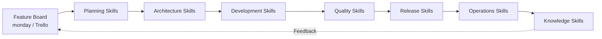
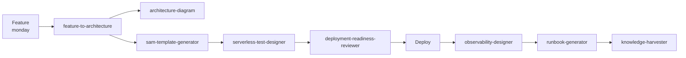

はい。サーバーレスのチーム開発では、AIエージェントを単なる「コーディング支援」にすると効果が限定されます。**要求・Feature → Architecture → IaC → Code → Test → Deploy → Observe → Learn** の流れそのものを Skill 化すると、開発速度と品質を同時に引き上げられます。

今回のプロジェクト目的である「サーバレスアプリケーションの設計、開発、運用に関わるインサイトを得る」という方向性とも非常に相性がよいです。

## 私なら3層構造にします



重要なのは、**monday.com操作Skill、AWS操作Skill、Diagram Skillをバラバラに作るのではなく、上位に「FeatureをProductionまで持っていくSkill」を置く**ことです。

---

# 推奨する Serverless Agent Skills

| Skill                           | エージェントが行うこと                    | 主な成果物                | 効果          |
| ------------------------------- | ------------------------------ | -------------------- | ----------- |
| `feature-board-manager`         | monday/TrelloのFeatureを取得・分解・更新 | Feature/Task/Status  | 開発管理高速化     |
| `feature-to-architecture`       | FeatureからAWS構成候補を作る            | Architecture案        | 設計高速化       |
| `architecture-diagram`          | SAM/CDK等から構成図生成                | Mermaid/SVG/PNG      | 設計共有        |
| `serverless-pattern-selector`   | API/event/async/workflow等を判定   | 推奨パターン               | 設計品質        |
| `adr-manager`                   | 設計判断をADR化                      | ADR Markdown         | 技術判断共有      |
| `sam-template-generator`        | 要件からSAM生成                      | template.yaml        | IaC高速化      |
| `iam-policy-reviewer`           | IAM権限を検査                       | 最小権限案                | Security    |
| `api-contract-designer`         | API/Event schema作成             | OpenAPI/EventSchema  | Interface品質 |
| `serverless-test-designer`      | Unit/Integration/E2E生成         | Test plan/code       | 品質向上        |
| `deployment-readiness-reviewer` | Deploy前チェック                    | Go/No-Go条件           | 障害防止        |
| `observability-designer`        | Logs/Metrics/Trace設計           | Dashboard/Alarm      | 運用品質        |
| `cost-impact-analyzer`          | Lambda/API GW等のコスト分析           | Cost estimate        | FinOps      |
| `incident-investigator`         | Logs/Metricsから原因分析             | RCA候補                | MTTR短縮      |
| `runbook-generator`             | Architectureから運用手順作成           | Runbook              | 運用標準化       |
| `knowledge-harvester`           | Issue/Incident/ADRを知識化         | Pattern/Anti-pattern | 組織学習        |

この中でも、最初から15個全部作るより、**6〜8個を一つのパイプラインとして接続する**方が効果が出ます。

---

# 1. `feature-board-manager`

ユーザー例にあった **Trello / monday.com Skill** はかなり重要です。

単なるカード編集Skillではなく、

> **Feature Boardを「AIエージェントと人間の共通Control Plane」にする**

という発想がおすすめです。

例えばFeature:

```text
Feature:
注文登録APIを追加する

Acceptance Criteria:
- POST /orders
- 非同期処理
- 5秒以内に受付応答
- 障害時再処理可能
```

を読み取ると、

```text
Feature
  ↓
Architecture Design
  ↓
Implementation Tasks
  ↓
Test
  ↓
Release
```

まで自動展開します。

monday.comは現在、公式Platform MCPからBoard/Item等をAIエージェントが直接read/writeでき、60以上のツールが公開されています。したがってAPIラッパーそのものを書くより、

**「Featureをどう解釈して、どんなTaskに分割するか」**

をSkill側に実装するのがよいでしょう。([monday.com Developer Platform][1])

TrelloでもREST APIからCard/Listの作成・更新・コメント追加などが可能です。([Atlassian Developer][2])

---

# 2. `feature-to-architecture`

個人的には、これを**中核Skill**にします。

Feature Boardから、

```yaml
feature:
  name: Order Registration

requirements:
  protocol: HTTP
  processing: async
  expected_rps: 100
  durability: required
  retry: required
```

を読み、

```text
API Gateway
     │
     ▼
Lambda
     │
     ▼
SQS
     │
     ▼
Lambda
     │
     ▼
DynamoDB
```

のようなArchitecture Candidateを作るSkillです。

重要なのは単なる「AWSサービス推薦」ではありません。

例えば、

```text
なぜSQSなのか？

・処理を非同期化したい
・一時的なバックエンド障害を吸収したい
・再試行が必要
・API応答時間とバックエンド処理時間を分離したい
```

まで生成します。

つまり成果物は、

```text
Feature
↓
Requirements
↓
Architecture Decision
↓
Architecture
```

です。

---

# 3. `architecture-diagram`

これはユーザーが挙げたSkillで、かなり価値があります。

ただし、

> 「文章 → 図」

より、

> **IaC → Architecture Model → Diagram**

にした方が強力です。

例えば、

```text
template.yaml
     ↓
Resource Graph
     ↓
Architecture Model
     ↓
Mermaid
     ↓
SVG / PNG
```

こうします。

するとArchitecture Diagramがコードと乖離しにくくなります。

さらに、

```text
Logical View
Runtime View
Security View
Observability View
Cost View
```

を同じモデルから生成できます。

---

# 4. `serverless-pattern-selector`

これは「AWSサービス検索Skill」ではなく、

**問題 → Architecture Pattern**

へ変換するSkillです。

例えば、

| 要件           | パターン                               |
| ------------ | ---------------------------------- |
| API受付        | API Gateway + Lambda               |
| 非同期化         | Queue-based Load Leveling          |
| Fan-out      | SNS / EventBridge                  |
| Workflow     | Step Functions                     |
| Event連携      | EventBridge                        |
| Stream       | Kinesis                            |
| Retry        | SQS + DLQ                          |
| Long-running | Step Functions / Durable execution |

AIエージェントに、

```text
このFeatureならどのパターンか？
```

を判断させます。

AWS自身も現在、Serverless向けエージェントSkillとしてLambda、Event Source、API Gateway、EventBridge、Step Functions、SAM/CDK Deployment等をまとめています。([GitHub][3])

---

# 5. `adr-manager`

私はこれを**かなり重要なSkill**だと考えています。

AIエージェントが設計すると、

> 「なぜその構成になったか」

が人間から見えなくなりやすいからです。

そこでArchitecture変更が起こるたびに、

```text
ADR-0023

Title:
Order ProcessingにSQSを採用

Context:
同期処理ではバックエンド障害が
API availabilityに影響する。

Decision:
API Gateway
→ Lambda
→ SQS
→ Lambda

Alternatives:
- EventBridge
- Step Functions

Consequences:
+ Decoupling
+ Retry
- Eventual consistency
```

を自動生成します。

さらにBoardのFeatureに、

```text
Architecture Decision:
ADR-0023
```

をリンク。

これだけで**AIの設計判断がチーム知識になります。**

---

# 6. `sam-template-generator`

Architecture Modelから、

```text
Architecture
     ↓
SAM Template
     ↓
Validation
     ↓
Build
     ↓
Local Test
```

まで実行します。

AWS Serverless MCP Serverは既にSAMのinitialize/build/deploy、Lambdaテスト、ログ・メトリクス取得、Serverless architecture guidanceなどを提供しています。([GitHub][4])

したがって自作Skillでは、

```text
AWS操作
```

そのものより、

```text
組織標準SAMを作るルール
```

を持たせるのがおすすめです。

例えば、

```yaml
rules:

  lambda:
    runtime:
      - python3.13
    tracing: active

  logging:
    format: JSON

  security:
    wildcard_iam: forbidden

  observability:
    alarm_required: true

  tags:
    required:
      - Application
      - Environment
      - Owner
```

のようにします。

---

# 7. `serverless-test-designer`

非常にROIの高いSkillです。

Architectureを読むと、

```text
Lambda Unit Test
API Integration Test
Event Contract Test
Failure Test
Retry Test
DLQ Test
Timeout Test
Idempotency Test
```

を生成します。

例えば、

```text
SQSがあります
```

ならAIが自動的に、

```text
□ Duplicate message
□ Consumer failure
□ Visibility timeout
□ Retry exhaustion
□ DLQ redrive
```

をテストケースに追加。

つまり、

> **Architectureからテストケースを逆生成**

します。

---

# 8. `deployment-readiness-reviewer`

Pull Request時にAIが、

```text
SAM
Code
Tests
IAM
Architecture
Observability
```

を横断レビューします。

例えば、

```text
Deployment Readiness

PASS
✓ Lambda timeout configured
✓ DLQ configured
✓ Structured logging enabled

WARNING
△ Reserved concurrency undefined

FAIL
✗ IAM Resource="*"
```

というレビューを生成。

単なるCode Reviewではなく、

> **Serverless Application Review**

にします。

---

# 9. `observability-designer`

Lambdaが追加されたら自動的に、

```text
Metrics
Logs
Trace
Alarm
Dashboard
```

を設計します。

例えば、

```text
Lambda
 ├─ Errors
 ├─ Duration
 ├─ Throttles
 └─ ConcurrentExecutions

SQS
 ├─ AgeOfOldestMessage
 └─ NumberOfMessagesVisible

API Gateway
 ├─ 4XX
 ├─ 5XX
 └─ Latency
```

を生成。

さらに、

```text
Feature
↓
SLO
↓
SLI
↓
CloudWatch Metric
↓
Alarm
```

までリンクさせると非常に強力です。

---

# 10. `incident-investigator`

運用側のAIエージェントです。

例えば、

```text
API Gateway 5xx増加
```

を検知すると、

```text
API Gateway
      ↓
Lambda Errors
      ↓
Lambda Logs
      ↓
Downstream DynamoDB
```

を辿ります。

そして、

```text
Possible Cause

1. DynamoDB throttling
2. Lambda timeout
3. Lambda concurrency saturation
```

まで絞り込みます。

AWS Serverless MCPもログ・Metrics取得やトラブルシューティングをサポートしています。([GitHub][4])

---

# 11. `runbook-generator`

設計完成時に、

```text
Architecture
+
Observability
+
Deployment
```

からRunbookを生成します。

例えば、

```text
Scenario:
SQS backlog increase

Detection:
ApproximateAgeOfOldestMessage

Check:
1. Lambda Errors
2. Lambda Throttles
3. Concurrency
4. DLQ

Recovery:
1. Identify failing message
2. Fix consumer
3. Deploy
4. Redrive DLQ
```

という形式です。

---

# 12. `knowledge-harvester`

これが意外に重要です。

IncidentやPR、ADRから、

```text
Problem
Decision
Solution
Lesson
```

を抽出します。

例えば、

```text
Incident #143
Lambda duplicate processing
```

から、

```text
Pattern:
Lambda consumer must be idempotent
```

をKnowledge Baseへ追加。

次回、新しいSQS Lambdaを作る時に、

```text
過去Incident #143より
Idempotency実装を推奨
```

とAIが指摘します。

これによって、

> **AIがチームの経験を蓄積する**

構造になります。

---

# 特に面白いのが「Skill同士を連結する」こと

例えばFeature Boardで、

```text
Feature:
画像アップロード機能
```

を作ったとします。

AIエージェントが、



まで自律的に進める。

これが実現すると、Feature Boardにカードを1枚追加することが、

```text
「プロジェクト管理操作」
```

ではなく、

```text
「Serverless Development Pipelineの開始イベント」
```

になります。

---

# Skillよりさらに重要なのが「共通データモデル」

私なら各Skill間で自然言語を直接受け渡さず、次のような中間モデルを置きます。

```yaml
feature:
  id: FEAT-102
  name: order-registration

business:
  priority: high

interface:
  type: REST
  method: POST
  path: /orders

processing:
  mode: async
  retry: true
  idempotency: required

architecture:
  entrypoint: api_gateway
  compute:
    - lambda
  messaging:
    - sqs
  database:
    - dynamodb

quality:
  availability: 99.9
  latency_ms: 500

security:
  authentication: cognito

observability:
  tracing: true
  structured_logging: true
```

そして、

```text
            Serverless Application Model
                       │
       ┌───────────────┼───────────────┐
       ▼               ▼               ▼
 Architecture       Testing          Operations
   Skill             Skill             Skill
       │               │               │
       ▼               ▼               ▼
    Diagram          Tests           Runbook
```

とします。

これによりSkill追加が非常に容易になります。

---

# 最初に作るなら「8 Skill」でよい

私ならPoCでは次の構成にします。

1. `feature-board-manager`
2. `feature-to-architecture`
3. `architecture-diagram`
4. `adr-manager`
5. `sam-template-generator`
6. `serverless-test-designer`
7. `deployment-readiness-reviewer`
8. `runbook-generator`

この8つだけでも、

```text
Feature
   ↓
Architecture
   ↓
ADR
   ↓
Diagram
   ↓
SAM
   ↓
Test
   ↓
Review
   ↓
Runbook
```

という**ほぼ一つの「Serverless Software Factory」**になります。

なお、現在のAWS側も、MCPサーバー単体からさらに進んで、エージェント向けの「Skill/SOP」を中心にAWS操作を組み立てる方向へ動いています。AWS Labs自身もAgent Toolkit for AWSをMCP servers/plugins/skillsの後継として案内しています。([GitHub][5])

## 一番先進的な形

最終的には、人間が個々のSkillを直接呼ぶのではなく、

> **`feature-to-production` Skill**

だけを呼ぶ構造が理想です。

```text
人間
 │
 │ 「FEAT-102を実装可能な状態にして」
 ▼
Product Agent
 │
 ├─ Feature Board Skill
 ├─ Requirements Skill
 ├─ Architecture Skill
 ├─ Diagram Skill
 ├─ ADR Skill
 ├─ SAM Skill
 ├─ Security Skill
 ├─ Test Skill
 ├─ Review Skill
 ├─ Deployment Skill
 └─ Runbook Skill
```

つまりAIエージェントを**「優秀なペアプログラマ」ではなく、「Serverless開発プロセスそのものを実行するチームメンバー」へ進化させる**イメージです。

この設計なら、次に作るべきものとして特に面白いのは、**「サーバーレスAI開発チームのSkillカタログ」を30個程度まで拡張し、Product Owner / Architect / Developer / QA / SRE の5つのAIエージェントへ役割分担した組織図**です。これを作ると、どのSkillを共通化し、どのSkillを専門Agentへ持たせるべきかまで整理できます。

[1]: https://developer.monday.com/api-reference/docs/platform-mcp-tools?utm_source=chatgpt.com "Platform MCP tools"
[2]: https://developer.atlassian.com/cloud/trello/rest/api-group-lists/?utm_source=chatgpt.com "The Trello REST API"
[3]: https://github.com/awslabs/agent-plugins?utm_source=chatgpt.com "GitHub - awslabs/agent-plugins: Agent Plugins for AWS equip AI coding agents with the skills to help you architect, deploy, and operate on AWS. · GitHub"
[4]: https://github.com/awslabs/mcp/blob/main/src/aws-serverless-mcp-server/README.md?utm_source=chatgpt.com "mcp/src/aws-serverless-mcp-server/README.md at main · awslabs/mcp · GitHub"
[5]: https://github.com/awslabs/mcp/blob/main/README.md?utm_source=chatgpt.com "mcp/README.md at main · awslabs/mcp · GitHub"
