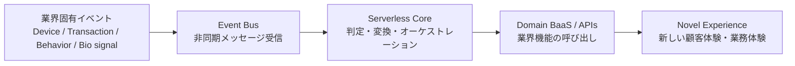
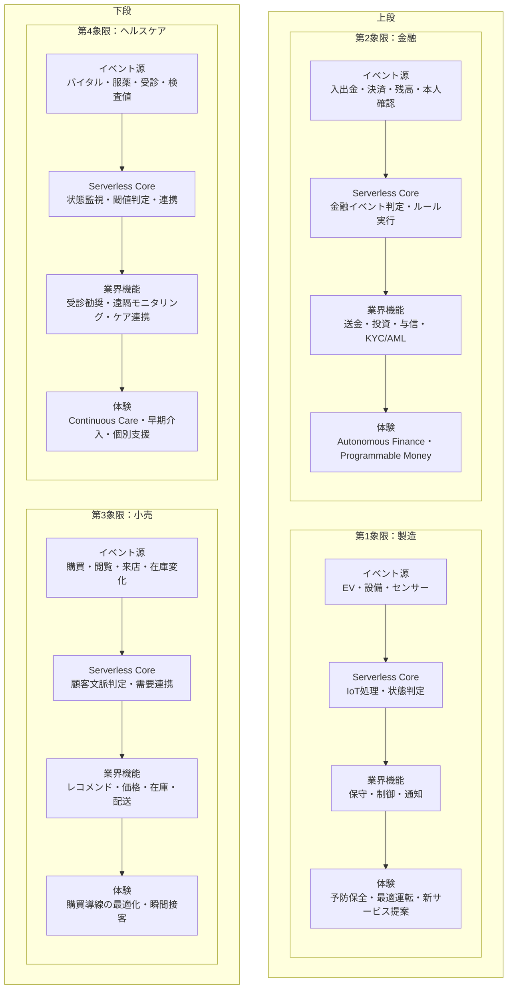
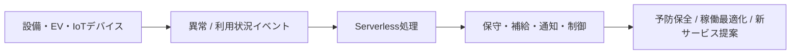
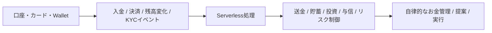
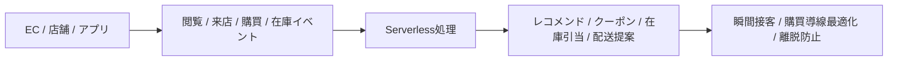
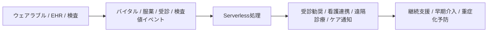
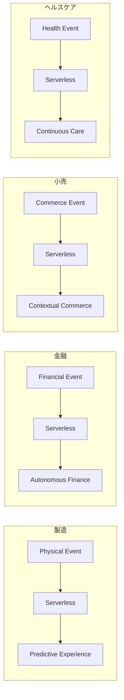

以下のように整理すると、**4業種それぞれの「Serverless Killer Pattern」**を、同じ見方で比較しやすくなります。

---

# 全体像

まず、4業種に共通する骨格は次の通りです。

> **業界固有のイベント**
> → **Serverlessで受信・判定・連携**
> → **業界機能をBaaS/Backend機能として呼び出す**
> → **ユーザーに新しい体験を返す**

---

## 1. 共通テンプレート

このテンプレートに各業界の具体例を流し込むと、比較しやすくなります。

---

# 2. 4業種を同じフォーマットで4象限化

ここでは、4象限を**業界ごとの代表的なキラーパターン**として配置します。

---

# 3. 4業種の「Killer Pattern」を同じフォーマットで比較

| 業種    | イベント源                 | Serverlessで行うこと          | 呼び出す業界機能             | キラーコンテンツ                  |
| ----- | --------------------- | ------------------------ | -------------------- | ------------------------- |
| 製造    | EV、設備、センサー、ウェアラブル     | 状態変化の検知、異常判定、連携処理        | 保守、稼働最適化、遠隔制御、部品手配   | **Predictive Experience** |
| 金融    | 入出金、決済、残高、属性変化、信用イベント | ルール実行、リスク判定、金融オーケストレーション | 送金、投資、融資、保険、KYC/AML  | **Autonomous Finance**    |
| 小売    | 閲覧、来店、購買、在庫、配送イベント    | 顧客文脈理解、需要連動、チャネル横断連携     | レコメンド、価格調整、在庫引当、配送提案 | **Contextual Commerce**   |
| ヘルスケア | バイタル、服薬、検査値、受診履歴      | 閾値監視、トリアージ、医療連携          | 受診勧奨、遠隔診療、ケア通知、健康支援  | **Continuous Care**       |

---

# 4. 各業種を一言で言うと

* **製造**
  Physical Event → Operational / Customer Experience

* **金融**
  Financial Event → Autonomous Financial Action

* **小売**
  Commerce Event → Contextual Purchase Experience

* **ヘルスケア**
  Health Event → Continuous Intervention / Care

---

# 5. 業種別の見え方

---

## 5-1. 製造：Predictive Experience

製造業では、イベント源は主に**物理世界**です。
設備、車両、センサーが「今こういう状態になった」と通知し、それをサーバレスがさばきます。

### パターン

### キラー性

価値は、**「壊れたら対応」から「壊れる前に提案」へ変えること**です。
つまり、サーバレスは単なる受信基盤ではなく、**物理イベントをサービス体験に変換するエンジン**です。

---

## 5-2. 金融：Autonomous Finance

金融では、イベント源は**お金の状態変化**です。
入金、支払い、残高、信用状態、本人確認結果などがトリガーになります。

### パターン

### キラー性

価値は、**「ユーザーが銀行アプリを開いて操作する」から「金融サービスがイベントをきっかけに先回りする」へ変えること**です。
製造業でいう「予防保全」に近いのが、金融でいう**Autonomous Finance**です。

---

## 5-3. 小売：Contextual Commerce

小売では、イベント源は**購買行動と在庫変化**です。
閲覧、カート投入、来店、在庫減少、配送遅延などが非同期イベントになります。

### パターン

### キラー性

価値は、**人手の接客を、イベント駆動で“瞬間的に再現”できること**です。
例えば「在庫が少ない」「顧客が店舗近辺にいる」「過去に類似商品を見た」などを組み合わせ、
**最も買いやすいタイミングで提案**できます。

---

## 5-4. ヘルスケア：Continuous Care

ヘルスケアでは、イベント源は**身体状態と医療行動**です。
バイタル、服薬、睡眠、検査値、受診記録などがイベントになります。

### パターン

### キラー性

価値は、**「具合が悪くなってから受診」ではなく「悪化の兆候が見えた時点で介入」できること**です。
つまりサーバレスは、単なる医療ITではなく、**ケアのタイミングを前倒しする仕組み**になります。

---

# 6. 4業種を1枚で眺めるための統合図

この図で分かるのは、4業種とも本質は同じだということです。

---

# 7. まとめ

4業種を同じフォーマットで見ると、Serverless Killer Pattern は次のように言えます。

## 共通構造

**イベント**
→ **Serverlessで即時処理**
→ **業界機能を組み合わせる**
→ **新しい体験を返す**

## 業種ごとの本命

* **製造**：Predictive Experience
* **金融**：Autonomous Finance
* **小売**：Contextual Commerce
* **ヘルスケア**：Continuous Care

つまり、サーバレスの価値は
**「関数を細かく実装できること」ではなく、業界イベントを顧客価値へ変換する回路を作れること**
にあります。

---

必要であれば次に、これをさらに発展させて次のどちらかの形に整理できます。

1. **経営層向けの1枚スライド風構成**
2. **業種別にAWSサービス例（EventBridge, Lambda, Step Functions, API Gateway など）を当てはめたMermaid図**

必要ならそのまま続けて作ります。
