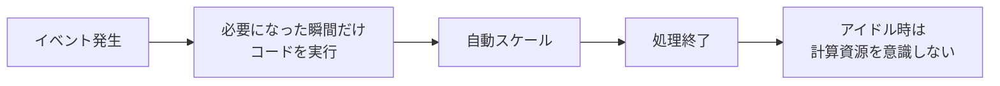
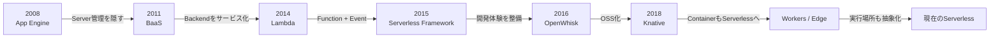

# サーバーレス勃興史――「サーバーを消した」のではなく、開発者の仕事からサーバーを消していった人々

クラウド初学者にサーバーレスを紹介するなら、**AWS Lambda の機能史として説明しない**ほうが理解しやすいと思います。

サーバーレスの歴史は、およそ20年間にわたって開発者たちが繰り返してきた、ひとつの問いの歴史だからです。

> **「アプリケーションを作りたいのに、なぜ私はサーバーの面倒を見ているのだろう？」**

この問いに対して、世代の異なる開発者たちが少しずつ答えを出していきました。


---

## 第1章 2008年――「サーバーを借りる」だけでは、まだ足りなかった

2006年にAmazon EC2が登場すると、サーバーを購入する必要はなくなりました。

これは革命的でした。しかし、開発者の仕事を並べてみると、

```text
アプリを書く
   ↓
VMを作る
   ↓
OSを設定する
   ↓
Webサーバーを設定する
   ↓
ロードバランサーを設定する
   ↓
スケールアウトを考える
   ↓
監視する
   ↓
パッチを当てる
```

**サーバーはクラウドへ移っただけで、サーバー管理そのものは残っていました。**

そこへ2008年、Googleのエンジニアリングチームが **Google App Engine** を投入します。

App Engineの発想は非常に大胆でした。

> アプリケーションを持ってきてください。
> スケーリングやインフラはプラットフォーム側で処理します。

当初から自動スケーリング、ロードバランシング、データストアなどが組み込まれ、「インフラスタックをGoogle側で処理し、開発者はコードに集中する」という思想が明示されています。後にGoogle自身もApp Engineを初期のserverless platformとして位置づけています。 ([Google Cloud Blog][1])

### この時代の開発者が消したもの

```text
物理サーバー
   ↓
仮想サーバー
   ↓
OS管理
   ↓
ミドルウェア管理
   ↓
      App Engine
```

ただし、まだ「アプリケーション」という大きな単位をデプロイしていました。

**サーバーレスの思想は生まれていたものの、まだ“関数”にはなっていなかった**のです。

---

# 第2章 2011〜2012年――モバイル開発者が「バックエンドすら作りたくない」と言い始める

スマートフォン時代になると、別の問題が発生しました。

iOSやAndroidの開発者がアプリを作ろうとすると、

```text
ログイン
ユーザーDB
Push通知
データ同期
API
認証
```

のためだけにバックエンドサーバーを作らなければなりません。

そこで **Parse** や **Firebase** といったBackend as a Service、つまり **BaaS** が登場します。

ParseのJames Yu、Tikhon Bernstamらのチームが狙ったのは、モバイル開発者がサーバーサイド技術まで習得しなくても、データ保存やユーザー管理を利用できる世界でした。 ([TechCrunch][2])

FirebaseのJames Tamplinらはさらに踏み込みます。

Firebaseは元々リアルタイムチャットサービス **Envolve** の技術から生まれました。ところが開発者たちはチャットそのものではなく、その背後にあった**リアルタイムデータ同期基盤**を欲しがった。そこで彼らは、その部分をサービスとして切り出しました。 ([TechCrunch][3])

これは重要な転換です。

### App Engineの発想

```text
「アプリを作る。
   サーバー管理は任せる」
```

### Firebase / Parseの発想

```text
「そもそも
   バックエンドの一部を作らない」
```

ここから現在の

* managed database
* managed authentication
* object storage
* messaging
* API

を**組み合わせてアプリケーションを作る**というサーバーレス的発想が育っていきます。

---

# 第3章 2013〜2014年――Tim Wagner、「アプリ」ではなく「コード」をクラウドへ投げる

そして物語の中心人物の一人が登場します。

## Tim Wagner

2013年ごろ、AWS社内ではJeff BarrとTim Wagnerらが、

> 開発者がインフラではなくコードそのものに集中するにはどうすればいいのか

を議論していました。

Jeff Barrの回想によれば、会議の中で、

> コードを空中に放り投げたら、クラウドが受け取って保存し、実行してくれればよいのではないか

というイメージが語られます。

Tim WagnerはこのアイデアをPRFAQにまとめ、やがてAWS内部で実装が進められました。 ([Amazon Web Services, Inc.][4])

そして2014年11月。

## AWS Lambda 登場

Lambdaが変えた最大のものは料金体系だけではありません。

**クラウドにおける「計算の単位」を変えました。**

それまでは、

```text
Server
 ↓
VM
 ↓
Container
 ↓
Application
```

だったものが、

```text
Event
  ↓
Function
  ↓
終了
```

になったのです。

最初のLambdaはNode.jsコードを、S3、DynamoDB、Kinesisなどのイベントに応じて実行できました。インフラリソースはAWSが自動的に管理しました。 ([Amazon Web Services, Inc.][5])

ここでサーバーレスに決定的な特徴が加わります。



### Tim Wagnerたちが消したもの

**「常時動いているアプリケーションサーバー」という前提です。**

これがFaaS――Functions as a Serviceの大きな転換点になりました。

---

# 第4章 2015年――Austen Collins、「Lambdaはすごい。でもアプリを作るには面倒だ」

Lambdaが登場すると、すぐに次の問題が出ます。

Lambda関数を1個作るのは簡単です。

しかし実際のアプリケーションは、

```text
API Gateway
Lambda
IAM
DynamoDB
S3
CloudWatch
Deployment
Environment
```

などを組み合わせる必要があります。

つまり、

> **サーバー管理はなくなった。
> しかしクラウドリソースを接着する作業が増えた。**

この問題に取り組んだのが **Austen Collins** と **Ryan Pendergast** らです。

彼らは2015年に **JAWS** というオープンソースプロジェクトを開発しました。

```bash
jaws project create
jaws module create greetings hello
```

のようなCLIから、LambdaとAPI Gatewayを組み合わせたアプリケーションを構築できました。 ([GitHub][6])

JAWSはやがて名前を変えます。

## Serverless Framework

です。

2016年には、すでにGitHubで大きなコミュニティへ成長していました。 ([Serverless Framework][7])

これは技術史上かなり重要な出来事です。

AWSが作ったのは**Lambdaという計算基盤**でした。

Austen Collinsたちが作ったのは、

> **「サーバーレスでアプリケーションを開発する」という開発体験**

でした。

---

# 第5章 2016〜2018年――サーバーレスは「AWSの商品名」ではなくなる

ここから物語は一社のクラウドを離れます。

IBM Researchでは2015年頃からserverless platformの研究が始まり、2016年に **OpenWhisk** としてオープンソース化されました。

さらにAdobeやRed Hatなども参加し、Apache Software Foundationのプロジェクトへ発展していきます。 ([IBM][8])

これは、

```text
Lambda
=
AWSだけが実装できる特殊なサービス
```

という認識を、

```text
FaaS
=
実装可能な
クラウドアーキテクチャ
```

へ変える一歩でした。

---

# 第6章――そしてコミュニティが「設計学」を作り始める

ここで非常に面白いことが起こります。

初期のserverlessには、教科書がありませんでした。

そのため、実際に使った開発者たちが、

> 「こうすると上手くいった」

という知識を書き始めます。

その代表例の一人が **Jeremy Daly** です。

彼は2015年頃からLambdaを使い始め、2016年にはServerless Architectureについて発信し、その後

* API
* 非同期処理
* SNS/SQS
* DynamoDB
* cold start
* microservices
* security

など、実運用から得られたパターンを大量に公開しました。 ([Jeremy Daly][9])

同じ頃、Mike Robertsなどのエンジニアもserverless architectureを整理し、

> **BaaS + FaaS**

という形でその概念を説明しました。 ([martinfowler.com][10])

ここでserverlessは、

**クラウドベンダーの機能から、ソフトウェアアーキテクチャの一分野へ変わります。**

---

# 第7章 2018年――「LambdaでなくてもServerlessではないか？」

次に開発者たちが疑問を持ちます。

> Functionだけがserverlessなのか？

Google、IBM、Red Hat、VMware、SAPなどのエンジニアが取り組んだ答えの一つが、

## Knative

でした。

2018年にGoogleから公開され、Kubernetes上で

* autoscaling
* scale-to-zero
* routing
* eventing
* deployment

などserverlessに必要な構成要素を提供します。 ([Google Cloud][11])

発想が変わります。

```text
2014
Serverless ≒ Function

       ↓

2018

Serverless
    =
インフラを意識せず
必要な時だけ実行され
自動でスケールする
「実行モデル」
```

Knative 1.0には600人以上の開発者が貢献しました。 ([Knative][12])

つまりこの頃から、サーバーレスを作っている主人公は**特定企業の数人ではなく、OSSコミュニティそのもの**になっていきます。

---

# 第8章 2017年〜――Kenton Varda、「コードをもっとユーザーの近くで動かそう」

さらに別方向からserverlessを再発明した人物がいます。

## Kenton Varda

Cloudflare Workersの開発を率いたエンジニアです。

Cloudflareには世界中にエッジサーバーがあります。

しかし従来のVMやコンテナを、

```text
東京
シンガポール
ロンドン
ニューヨーク
サンパウロ
...
```

すべてにユーザーごとに立ち上げるのは現実的ではありません。

そこでCloudflareのチームは、コンテナではなく **V8 Isolate** を採用しました。

JavaScriptコードを極めて軽量な分離環境で実行するという発想です。 ([Cloudflare Blog][13])

ここでserverlessの問いがまた変わります。

以前：

> **「サーバーをどう管理しなくて済むか？」**

Lambda：

> **「コードを必要な時だけどう実行するか？」**

Workers：

> **「そのコードをユーザーのすぐ近くでどう実行するか？」**

でした。



---

# そして現在――開発者たちが本当に消したかったもの

ここまでを見ると、serverlessの本質が見えてきます。

彼らがサーバーそのものを嫌っていたわけではありません。

消そうとしていたのは、

> **「ユーザー価値と関係のないインフラ作業を、アプリケーション開発者が毎回考えなければならない状態」**

だったと見ることができます。

歴史を一行ずつ並べると、とてもきれいです。

| 時代    | 開発者が疑問に思ったこと                  | 生まれた考え                      |
| ----- | ----------------------------- | --------------------------- |
| 2008  | なぜWebサーバーを管理するのか              | App Engine / PaaS           |
| 2011  | なぜ認証やDBを毎回作るのか                | BaaS                        |
| 2014  | なぜアプリサーバーを常時動かすのか             | Lambda / FaaS               |
| 2015  | なぜFunctionを手作業で組み立てるのか        | Serverless Framework        |
| 2016  | なぜ特定クラウドだけなのか                 | OpenWhisk                   |
| 2018  | なぜFunctionしかServerlessにできないのか | Knative                     |
| 2017〜 | なぜコードを遠いDCで動かすのか              | Edge Serverless             |
| 現在    | なぜインフラ構成を人間が毎回判断するのか          | Platform Engineering / AI支援 |

---

# 初学者には、最後にこの一言を残すとよい

私は講義なら、最後をこう締めます。

> **Serverlessとは「サーバーがない技術」ではない。**
>
> 2008年から多くの開発者たちが、
> **「アプリケーションを作る人間が、どこまでインフラを考えなくてよいのか」**
> という境界線を少しずつ押し下げてきた結果である。

これなら、Lambdaを単独の技術として覚えるのではなく、

```text
EC2
「サーバーをAPI化した」

        ↓

App Engine
「サーバー管理を抽象化した」

        ↓

Firebase
「バックエンド機能をサービス化した」

        ↓

Lambda
「実行そのものをイベント化した」

        ↓

Serverless Framework
「その組み合わせを開発工程にした」

        ↓

Knative
「Serverlessを実行モデルにした」

        ↓

Edge Serverless
「実行場所まで抽象化した」
```

という**クラウドエンジニアリングの抽象化の歴史**として理解できます。

そして、この見方はサーバーレスの設計・開発・運用からインサイトを得る、という今回のプロジェクトの目的とも非常に相性がよいです。 

特に初学者向けプレゼンにするなら、**Tim Wagner → Austen Collins → IBM/KnativeのOSS開発者 → Kenton Varda**を「4人（4世代）の主人公」に絞り、**「彼らは前の世代が残した何を面倒だと感じたのか」**という連続ドラマにすると、1時間程度の技術プレゼンとしてかなり印象に残る構成になります。

[1]: https://cloudplatform.googleblog.com/2008/04/introducing-google-app-engine-our-new.html?utm_source=chatgpt.com "Google Cloud Platform Blog: Introducing Google App Engine + our new blog"
[2]: https://techcrunch.com/2011/08/04/yc-funded-parse-a-heroku-for-mobile-apps/?utm_source=chatgpt.com "YC-Funded Parse: A Heroku For Mobile Apps | TechCrunch"
[3]: https://techcrunch.com/2012/04/19/firebase-post-launch/?utm_source=chatgpt.com "Firebase Aims To Reinvent Real-Time App Infrastructure, And It Already Has 4,000 Sign-Ups | TechCrunch"
[4]: https://aws.amazon.com/jp/blogs/news/aws-lambda-turns-ten-the-first-decade-of-serverless-innovation/?utm_source=chatgpt.com "10 周年を迎えた AWS Lambda – 過去を振り返り、未来を見据えて | Amazon Web Services ブログ"
[5]: https://aws.amazon.com/about-aws/whats-new/2014/11/13/introducing-aws-lambda/?utm_source=chatgpt.com "Introducing AWS Lambda - AWS"
[6]: https://github.com/MrRio/JAWS?utm_source=chatgpt.com "GitHub - MrRio/JAWS: JAWS: The Server-less Application Framework – Uses bleeding-edge AWS services to redefine how to build massively scalable (and cheap) apps! · GitHub"
[7]: https://www.serverless.com/blog/beginning-serverless-framework-v1?utm_source=chatgpt.com "Beginning Serverless Framework V.1 | Serverless Framework"
[8]: https://www.ibm.com/opensource/story/?utm_source=chatgpt.com "Get involved with open source projects - Call for Code - IBM Developer"
[9]: https://old.jeremydaly.com/serverless/?utm_source=chatgpt.com "Serverless - Post and How-Tos about Serverless Technology - Jeremy Daly"
[10]: https://martinfowler.com/articles/serverless.html?utm_source=chatgpt.com "Serverless Architectures"
[11]: https://cloud.google.com/blog/products/gcp/bringing-the-best-of-serverless-to-you?utm_source=chatgpt.com "Updates on Google Cloud's serverless compute stack 2018 | Google Cloud Blog"
[12]: https://knative.dev/blog/releases/knative-1.0/?utm_source=chatgpt.com "Details on the 1.0 release of Knative - Knative"
[13]: https://blog.cloudflare.com/introducing-cloudflare-workers/?utm_source=chatgpt.com "Introducing Cloudflare Workers: Run JavaScript Service Workers at the Edge | Cloudflare Blog"
