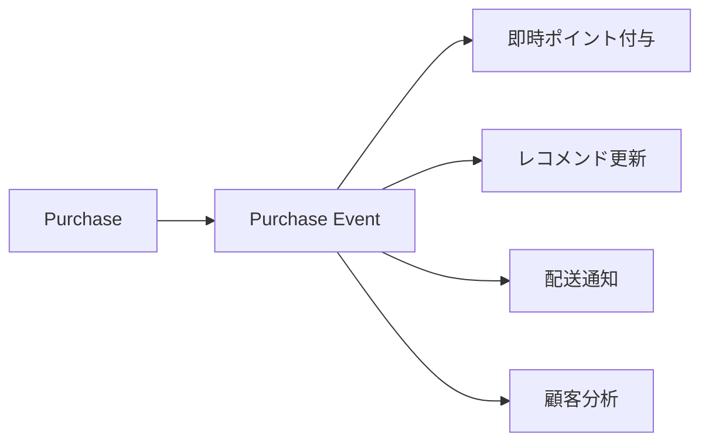
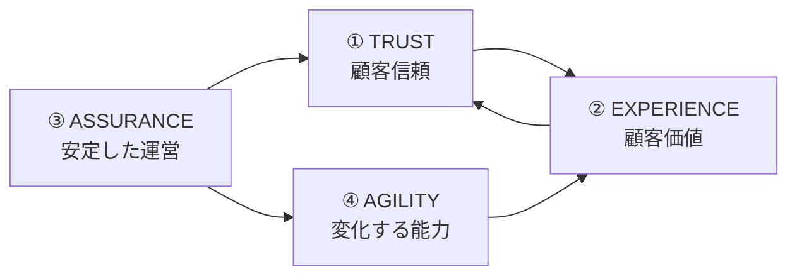

サーバーレスの価値をビジネスオーナーへ説明するなら、**「技術の種類」ではなく「何を守り、何を伸ばすか」**で4象限に整理すると伝わりやすくなります。

軸は次の2つを推奨します。

* **横軸：Protect ←→ Grow** — 現在の事業を守る価値か、将来の事業を伸ばす価値か
* **縦軸：Business / Operation ←→ Customer / Product** — 社内・運営側への価値か、顧客が直接感じる価値か

## サーバーレス価値提案 4象限

```text
                         顧客・プロダクト価値
                               ↑
                               │
         ① TRUST               │          ② EXPERIENCE
      顧客の信頼を守る          │        顧客価値を拡張する
                               │
   ・サービスを止めにくい       │   ・新機能を素早く提供
   ・障害影響を限定             │   ・リアルタイム体験
   ・取引を正しく完遂           │   ・パーソナライズ
   ・高速なレスポンス           │   ・グローバルな低遅延
                               │
 ──────────────────────────────┼─────────────────────────────→
          PROTECT              │               GROW
       現在を守る               │            未来を伸ばす
                               │
         ③ ASSURANCE           │          ④ AGILITY
      事業運営を強くする         │        変化する力を高める
                               │
   ・運用負荷削減               │   ・市場投入を高速化
   ・障害復旧自動化             │   ・小さく実験
   ・需要変動への追従           │   ・サービスを再利用
   ・セキュリティ標準化         │   ・独立リリース
                               │
                               ↓
                         事業・オペレーション価値
```

この4象限を、サーバーレス技術の進化と結び付けるとさらに明確になります。

| 象限               | ビジネスオーナーへの価値提案             | 関連するServerless能力                   | 代表的パターン                                     |
| ---------------- | -------------------------- | ---------------------------------- | ------------------------------------------- |
| **① TRUST**      | 「売上や顧客信頼につながる重要機能を止めにくくする」 | 疎結合、障害分離、補償処理、自動スケール               | Event-driven、Saga、Cell-based、Queue          |
| **② EXPERIENCE** | 「顧客が感じるサービス価値を継続的に高める」     | 即時処理、並列処理、利用者近傍処理                  | Streaming、Fan-out、Edge、BFF                  |
| **③ ASSURANCE**  | 「サービス規模が拡大しても運営負荷とリスクを抑える」 | Managed Service、自動復旧、Workflow、権限制御 | BaaS、Workflow、Orchestration、FaaS            |
| **④ AGILITY**    | 「新しいアイデアを低リスク・短期間で市場へ出す」   | 小さい変更単位、疎結合、サービス組み合わせ              | FaaS、Microservices、Event-driven、Composition |

---

## ① TRUST — 「サービスが成功しても、壊れにくい」

最初の象限は、**現在の顧客価値を守る**領域です。

例えばECサービスなら、「システム稼働率」という技術KPIより、

* 注文を完了できる
* 二重課金されない
* メール配信障害が注文処理を止めない
* 一部障害が全顧客へ広がらない

ことの方が重要です。

Serverless Architectureでは、

```text
Event-driven
    ↓
疎結合化
    ↓
一部機能の障害を隔離
    ↓
重要な取引を継続
    ↓
顧客信頼・売上を守る
```

という価値連鎖を作れます。

ここでのメッセージは、

> **Serverlessは「システムを止めない」だけではなく、「止まっても顧客影響を小さくする」設計を可能にする。**

です。

---

## ② EXPERIENCE — 「技術進化を顧客体験へ変換する」

右上は、ビジネスオーナーに最も見せやすい象限です。

Streaming、Fan-out、Edge Serverlessなどは、直接、

* 即時通知
* リアルタイムレコメンド
* 最新在庫表示
* 高速レスポンス
* 個別パーソナライズ

といった顧客体験につながります。

例えば購入イベントを起点として、



という拡張が可能です。

つまり、

> **一つのビジネスイベントから複数の顧客価値を派生させられる。**

これがEvent-driven Serverlessの非常に大きな商品価値です。

---

## ③ ASSURANCE — 「事業規模と運用負荷を比例させない」

左下は、顧客からは見えにくいものの、事業成長には重要です。

従来型システムでは、

```text
利用者増加
   ↓
サーバー増加
   ↓
監視対象増加
   ↓
運用担当増加
```

となりがちです。

Serverlessでは、

```text
利用者増加
   ↓
Managed Service / Auto Scaling
   ↓
基盤側が処理能力を拡張
   ↓
運用チームはサービス品質管理へ集中
```

という構造を取りやすくなります。

したがって価値提案は「サーバー管理を削減できます」より、

> **売上規模が2倍になったとき、インフラ運用人数まで2倍にしなくてよい事業構造を作る。**

と説明した方がビジネス側には響きます。

---

# ④ AGILITY — Serverless最大の戦略的価値

右下は、Serverlessの長期的価値として特に重要です。

FaaS、BaaS、Event-driven、Microservicesの進化によって、アプリケーションが、

```text
巨大なシステムを変更する
```

から、

```text
必要なCapabilityだけ追加する
```

方向へ変わります。

例えば、

```text
「購入後に新しいCRM連携を追加したい」
```

場合、従来なら注文システムを変更するところを、

```text
Purchase Event
       ↓
新しいConsumer
       ↓
CRM連携
```

だけで実現できる設計が可能になります。

つまり、Serverlessによる品質とは、

**「現在正しく動いている」だけではありません。**

> **「明日、安全に変えられる」こともプロダクト品質である。**

ここがビジネスオーナーに伝えるべき重要なポイントです。

---

# 4象限は独立していない

さらに重要なのは、4象限が相互作用することです。



例えば、

**Managed Service → 運用余力創出 → 新機能開発 → 顧客体験向上**

という循環があります。

また、

**Event-driven → 障害分離 → 安全に変更可能 → リリース頻度向上**

という循環もあります。

したがってServerlessの本当の価値は、一つの象限を最大化することではありません。

> **「守る能力」と「変える能力」を同時に高められること**

にあります。

---

# 経営・プロダクト会議では、この一枚に集約できる

特にビジネスオーナーへの説明なら、技術名称を前面に出さず、次の4つだけを大きく見せる構成が有効です。

|        | **現在を守る — PROTECT**                 | **未来を伸ばす — GROW**                     |
| ------ | ----------------------------------- | ------------------------------------- |
| **顧客** | **TRUST**：「安心して使い続けられるプロダクト」        | **EXPERIENCE**：「新しい価値を継続的に体験できるプロダクト」 |
| **事業** | **ASSURANCE**：「成長しても安定して運営できるプロダクト」 | **AGILITY**：「市場変化に素早く適応できるプロダクト」      |

そして中心に **Serverless Architecture** を置きます。

サーバーレスへの投資判断を「Lambdaを採用するか」という議論から、

> **TRUST × EXPERIENCE × ASSURANCE × AGILITY のうち、我々のプロダクトはどの品質能力を強化する必要があるのか**

という議論へ変えられるからです。

この4象限は、前段の「**サーバーレス技術史 → アーキテクチャパターンへの分化**」と、後段の「**プロダクト戦略・KPI・投資判断**」を接続する中間フレームとして使うと特に効果的です。
