サーバーレス技術の進化をビジネスオーナー向けに説明する場合、**「サーバー管理が楽になる技術」ではなく、「プロダクト品質を構造的に改善するための選択肢が増えてきた歴史」**として整理すると伝わりやすくなります。

特に重要なのは、技術進化と品質の間に1段階挟むことです。

> **技術進化 → アーキテクチャ特性 → プロダクト品質 → 顧客・事業価値**

---

# 1. サーバーレスの進化を「品質能力の獲得」として見る

前回までの技術史を、ビジネス側から見ると次のように読み替えられます。

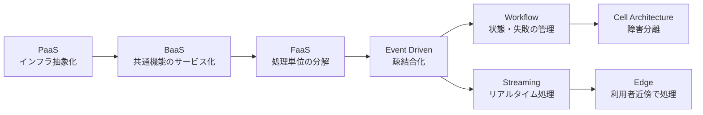

これらはそれぞれ、違う種類の「品質能力」をプロダクトへ追加してきました。

| 技術的進化        | 得られた能力     | プロダクト品質への反映    |
| ------------ | ---------- | -------------- |
| PaaS         | インフラ管理の標準化 | 安定性、開発速度       |
| BaaS         | 共通機能の再利用   | 一貫性、セキュリティ     |
| FaaS         | 独立した処理単位   | 変更容易性、スケーラビリティ |
| Event-driven | 疎結合        | 可用性、拡張性        |
| Workflow     | 状態管理       | 信頼性、業務整合性      |
| Streaming    | 即時処理       | 鮮度、応答性         |
| Cell-based   | 障害範囲制御     | レジリエンス         |
| Edge         | 利用者近傍処理    | レスポンス、UX       |

ここからがビジネスオーナーにとって重要です。

---

# 2. 「品質」を7つに分解すると理解しやすい

Serverlessがプロダクトにもたらす価値を、私は次の7軸で見ることを勧めます。

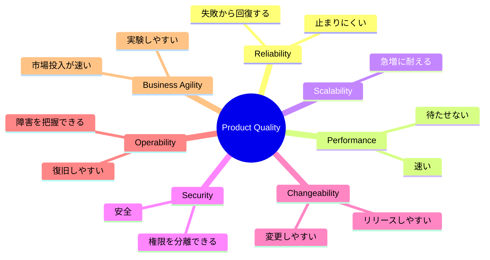

「Lambdaを使った」ということ自体には事業価値はありません。

重要なのは、

> **LambdaやEventBridgeやStep Functionsを採用した結果、上記のどの品質が改善したのか**

です。

---

# 3. FaaS：需要変動への追従性を品質に変える

まずLambdaなどのFaaSです。

従来型では、想定最大アクセスに合わせてサーバー容量を設計する必要がありました。

```text
想定アクセス
    ↓
サーバー容量予測
    ↓
台数設計
    ↓
負荷試験
    ↓
増強
```

FaaSでは、

```text
リクエスト
 ↓
必要な処理だけ起動
 ↓
負荷増加
 ↓
実行数増加
```

になります。

ビジネスオーナーから見ると、これは単なるAuto Scalingではありません。

### 商品品質としては

**「人気になっても壊れにくい」**

という品質になります。

例えばキャンペーンによってアクセスが通常の20倍になったとします。

ビジネス側から見れば、

> 「Lambdaが20倍スケールした」

ことはどうでもよい。

重要なのは、

> **キャンペーン成功がシステム障害の原因になりにくい**

ことです。

つまり、

```text
FaaS
 ↓
Elasticity
 ↓
ピーク耐性
 ↓
購入失敗の減少
 ↓
売上機会損失の低減
```

という品質変換が起きます。

---

# 4. BaaS：自前実装を減らすことで品質を上げる

例えば認証を考えます。

自社で認証機構を作れば、

* パスワード
* MFA
* Token
* Session
* Password reset
* Identity federation

などを実装・運用する必要があります。

Cognitoなどのマネージドサービスを使う場合、

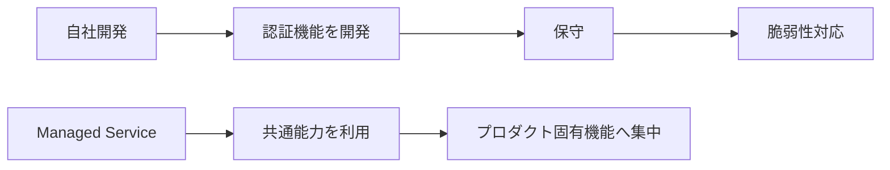

という変化になります。

これは、

> **Build less, differentiate more**

という品質戦略です。

つまり「全部自分で作れること」を品質とは考えず、

> **差別化にならない領域については、十分成熟した共通能力に任せる**

ことで、プロダクト固有部分へ品質投資を集中します。

---

# 5. Event-driven：一つの障害を全体障害にしにくくする

Event-driven Architectureの価値は、ビジネス側では非常に大きいです。

例えばECサイト。

同期処理では、

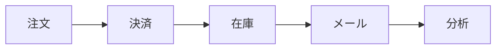

メールシステムが落ちるだけで注文処理まで失敗する設計になり得ます。

イベント駆動なら、

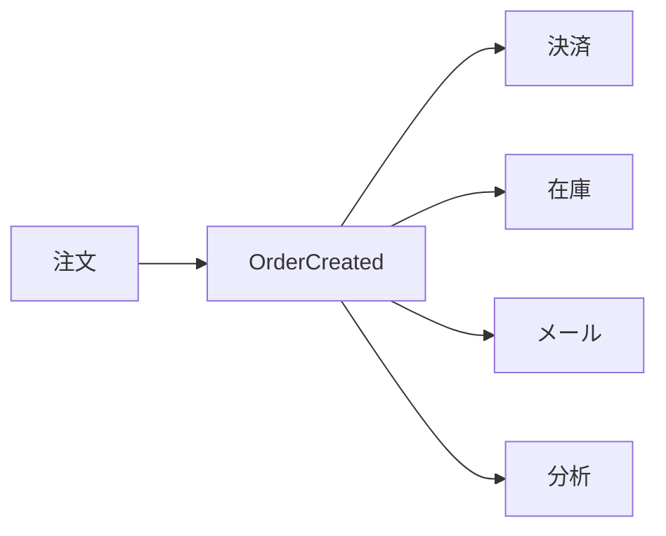

メール処理が失敗しても、

**注文そのものを成立させられる設計が可能になります。**

これは技術的には、

> Loose Coupling

ですが、ビジネス側では、

> **重要な顧客行動を、重要度の低い機能の障害から守る**

という品質になります。

---

# 6. Fan-out：一つのイベントからプロダクト価値を増殖させる

Event-drivenには別の品質効果もあります。

例えば、

```text
商品購入
```

というイベントに対して、

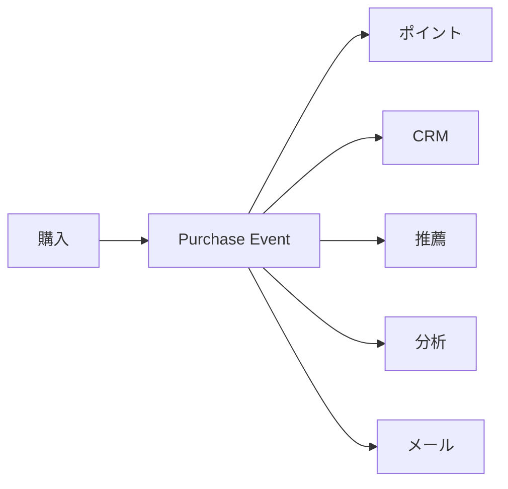

と処理を追加できます。

ここで重要なのは、

**元の注文機能を大きく変更せず、新しい機能を追加できる**

ことです。

プロダクト品質としては、

> **拡張可能性**

になります。

事業から見ると、

```text
新しい施策
     ↓
既存システム大改修
```

ではなく、

```text
新しい施策
     ↓
新しいイベント購読者を追加
```

となります。

これは新規施策の実験速度に直結します。

---

# 7. Workflow：業務処理の「正しさ」を高める

ServerlessがFunctionだけだった時代には苦手だったものがあります。

長い業務処理です。

例えば、

```text
申込
 ↓
本人確認
 ↓
与信
 ↓
契約
 ↓
課金
 ↓
サービス開始
```

です。

Workflow Engineを使うと、

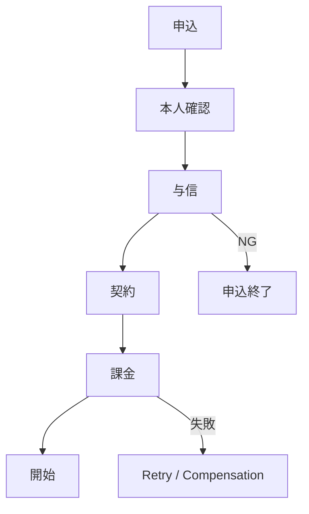

という業務状態そのものをシステムとして表現できます。

ビジネス品質では、

### Correctness

つまり、

> **業務が正しい順番で、抜けなく、二重実行されずに進む**

という品質になります。

金融、契約、決済、受発注などでは特に重要です。

---

# 8. Saga：失敗しても「業務として辻褄が合う」

分散システムでは「全部成功か全部失敗」というDBトランザクションが難しくなります。

例えば、

```text
注文成功
決済成功
在庫確保成功
配送失敗
```

という状態です。

Sagaでは、

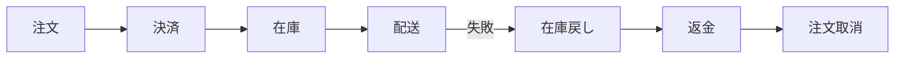

と補償処理を設計します。

これは技術品質ではConsistencyですが、顧客視点では、

> **失敗しても「お金だけ取られた」といった不正な状態を残さない**

品質です。

極めてビジネス的な品質です。

---

# 9. Streaming：情報の「鮮度」を品質にする

従来、

```text
データ
 ↓
夜間バッチ
 ↓
翌朝レポート
```

だったものが、

```text
データ発生
 ↓
Stream
 ↓
即時分析
 ↓
アクション
```

になります。

例えば、

* 不正決済検知
* 在庫更新
* 配送状況
* IoT異常
* レコメンド
* リアルタイムKPI

です。

Streamingが改善する品質は「処理速度」だけではありません。

## Information Freshness

です。

つまり、

> **ユーザーやビジネスが判断するとき、そのデータがどれだけ現在を表しているか**

という品質です。

---

# 10. Cell-based Architecture：「全員が落ちる」を防ぐ

サービスが成功すると、別の問題が現れます。

巨大な共有システムでは、一つの障害が、

```text
障害
 ↓
全ユーザー
```

へ広がります。

Cell-based Architectureでは、

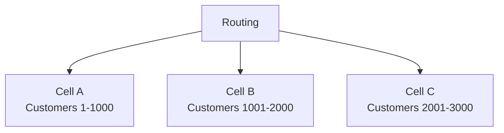

と分けます。

Cell Aが障害になっても、

```text
影響 = Cell Aだけ
```

に制限します。

ここで品質評価も変わります。

従来：

> 障害が発生したか？

成熟したプロダクト：

> **障害が発生したとき、何％の顧客へ影響したか？**

これは大きな進歩です。

---

# 11. Edge：性能を「インフラ性能」から「ユーザー体感品質」へ

Edge Serverlessでは処理をユーザーへ近づけます。

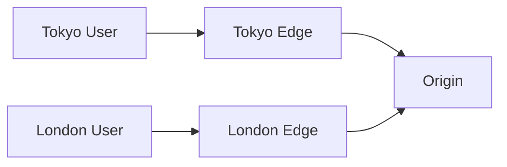

ビジネスオーナーが測るべきなのはCPU使用率ではありません。

例えば、

* ページ表示時間
* APIレスポンス
* checkout完了時間
* 検索結果表示時間

です。

つまり、

> **System performance → User-perceived performance**

への転換です。

---

# 12. Serverless Microservices：変更速度をプロダクト品質にする

マイクロサービス化されたServerlessでは、

```text
注文機能変更
```

のために、

```text
巨大アプリケーション全体をリリース
```

する必要を減らせます。

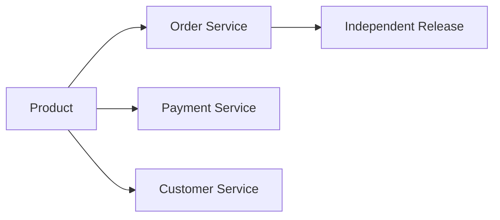

ここで生まれる品質が、

## Changeability

です。

良いプロダクトとは、

> **現在バグが少ない**

だけではありません。

市場が変わったとき、

> **安全に変更できる**

ことも重要な品質です。

---

# 13. したがって「品質」の定義自体が変わる

従来の品質管理では、

```text
品質
=
バグが少ない
```

と考えがちです。

しかしデジタルプロダクトでは不十分です。

Serverless Architectureを含む現代的なプロダクトでは、

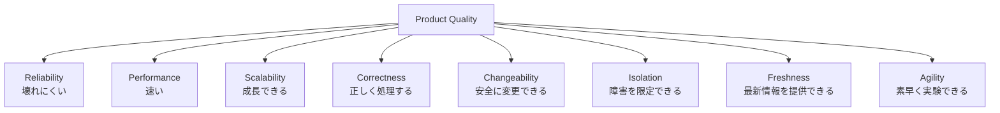

と考えた方が実態に近くなります。

---

# 14. 技術KPIを、そのまま経営KPIにしない

ここもビジネスオーナーには重要です。

例えば、

### 技術チーム

```text
Lambda error rate
= 0.2%
```

だけでは意味が分かりにくい。

ビジネス側では、

```text
注文成功率
= 99.8%
```

へ翻訳します。

同じように、

| 技術指標                 | プロダクト品質指標                        |
| -------------------- | -------------------------------- |
| Lambda Error Rate    | Transaction Success Rate         |
| API Latency          | User Response Time               |
| Queue Depth          | Processing Delay                 |
| Retry Count          | Completion Reliability           |
| Deployment Frequency | Feature Delivery Speed           |
| MTTR                 | Customer Impact Duration         |
| Cell Failure         | Affected Customer Ratio          |
| Event Processing Lag | Information Freshness            |
| Function Concurrency | Peak Demand Handling             |
| Workflow Failure     | Business Process Completion Rate |

つまり、

> **Cloud KPI → Product SLI → Business KPI**

という3段階にします。

---

# 15. 最終的には「Quality Chain」で考える

ビジネスオーナー向けには、次のモデルが最も使いやすいと思います。

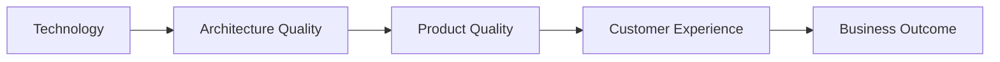

例えばEvent-drivenなら、

```text
EventBridge / Queue
        ↓
疎結合
        ↓
部分障害耐性
        ↓
注文成功率向上
        ↓
購入離脱減少
```

Workflowなら、

```text
Step Functions
      ↓
状態管理
      ↓
処理整合性
      ↓
注文・契約ミス削減
      ↓
顧客問い合わせ削減
```

Cell Architectureなら、

```text
Cell isolation
      ↓
Blast Radius縮小
      ↓
障害影響ユーザー減少
      ↓
サービス信頼性向上
      ↓
顧客維持
```

となります。

---

# 16. サーバーレス進化史をビジネス品質史として書き換える

ここまでを一本のストーリーにすると、かなりきれいです。

```text
PaaS
「運用ミスを減らす」

        ↓

BaaS
「共通機能を成熟したサービスへ任せる」

        ↓

FaaS
「需要変動へ自動追従する」

        ↓

Event Driven
「一つの障害を全体へ波及させない」

        ↓

Workflow / Saga
「複雑な業務を正しく完遂する」

        ↓

Streaming
「情報を新鮮なうちに価値へ変える」

        ↓

Cell Architecture
「障害が起きても影響範囲を限定する」

        ↓

Edge
「利用者がいる場所で高速に応答する」
```

これをさらに抽象化すると、

> **サーバーレスの歴史とは、「インフラ効率化」の歴史ではなく、プロダクトが持つべき品質能力をクラウドサービスとして獲得してきた歴史**

と捉えることができます。

---

# 17. ビジネスオーナーが問いかけるべき質問

そのため、ビジネスオーナーが技術チームに、

> 「Serverlessを使っていますか？」

と聞くことにはあまり意味がありません。

むしろ次のように聞くべきです。

1. **急激に利用者が増えたとき、どの顧客体験を守れますか？**
2. **一部の機能が故障しても、購入や契約など重要業務は継続できますか？**
3. **失敗した取引は、自動的に正しい状態へ戻せますか？**
4. **新しいプロダクト施策を既存機能への影響を小さく追加できますか？**
5. **障害発生時、影響する顧客を限定できますか？**
6. **市場の変化に対して、小さく安全にリリースできますか？**
7. **我々のユーザーが感じている品質を計測できていますか？**

この問いに対する技術的な回答として、FaaS、Event-driven、Saga、Cell-based、Edgeといったアーキテクチャが存在する、と説明すると、**技術選定と事業戦略が一本につながります。**

最終的なメッセージとしては、

> **Serverlessはコスト削減技術ではなく、「必要な品質を必要な場所へ組み込む」ためのプロダクト設計技術へ進化している。**

とすると、ビジネスオーナー向けにはかなり伝わりやすいでしょう。
